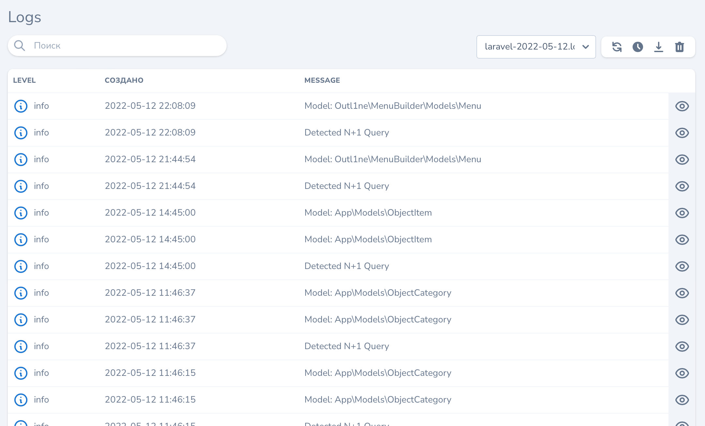
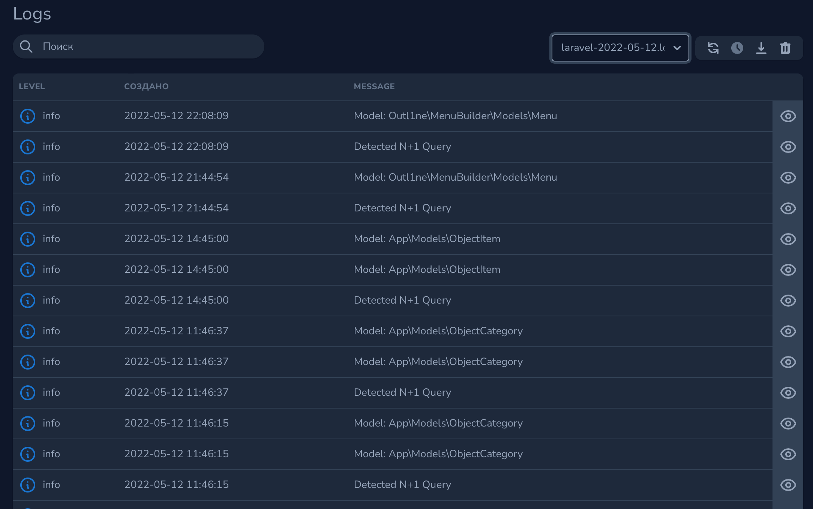
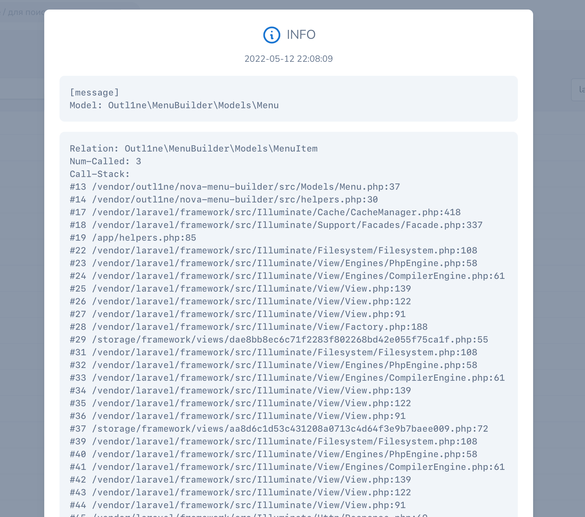
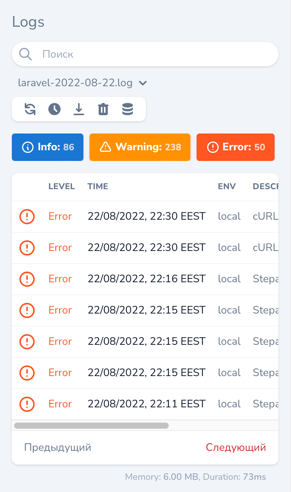
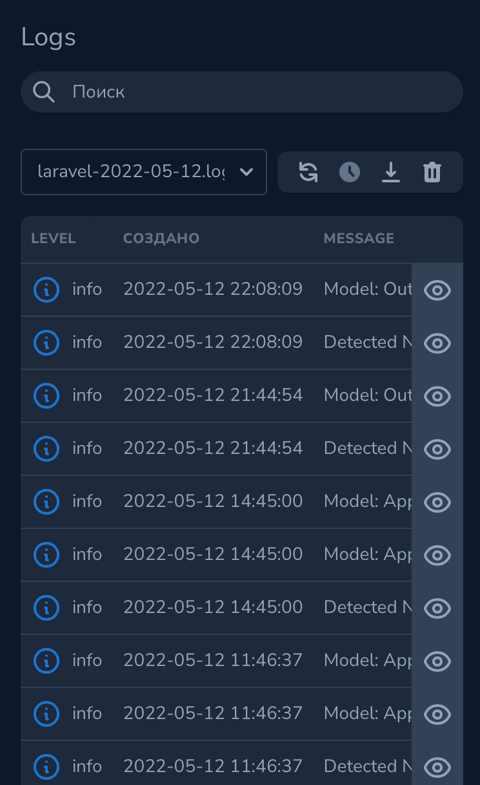

# Nova tool to view logs

[](https://packagist.org/packages/stepanenko3/nova-logs-tool)
[](https://packagist.org/packages/stepanenko3/nova-logs-tool)
[](https://packagist.org/packages/stepanenko3/nova-logs-tool)



## Description

A Laravel Nova tool to manage and keep track of each one of your logs files.

## Features

- 📂 View all the Laravel logs in your storage/logs directory,
- 📂 Logs from nested directories,
- 🔍 Search the logs,
- 🎚 Filter by log level (error, info, debug, etc.),
- 💾 Download & delete log files from the UI,
- ✅ Horizon log support,
- ⌚️ Polling logs,
- ⚫️ Dark mode,
- 📱 Responsive,
- 🕔 Show loading time and memory

## Requirements

- `php: >=8.0`
- `laravel/nova: ^4.0`

## Installation

You can install the package in to a Laravel app that uses [Nova](https://nova.laravel.com) via composer:

```bash
composer require stepanenko3/nova-logs-tool
```

Next up, you must register the tool with Nova. This is typically done in the `tools` method of the `NovaServiceProvider`.

```php
// in app/Providers/NovaServiceProvder.php

// ...

public function tools()
{
    return [
        // ...
        new \Stepanenko3\LogsTool\LogsTool(),
    ];
}
```

Publish the package configuration file.

```bash
php artisan vendor:publish --provider="Stepanenko3\LogsTool\LogsToolServiceProvider"
```

## Authorization

```php
// in app/Providers/NovaServiceProvder.php

// ...

public function tools()
{
    return [
        // ...
        // don't return plain `true` value or anyone can see/download/delete the logs, make sure to check if user has permission.
        (new \Stepanenko3\LogsTool\LogsTool())
                ->canSee(fn () => auth()->user()->canSee())
                ->canDownload(fn () =>   auth()->user()->canDownload())
                ->canDelete(fn () => true),
    ];
}
```

## Usage

Click on the "nova-logs-tool" menu item in your Nova app to see the tool provided by this package.

Possible environment variables:

``` env
LOG_VIEWER_FILES_ORDER=newest
LOG_VIEWER_PER_PAGE=25
```

## Show latest logs on Dashboard

Create Metric class in app/Nova/Metrics

```php
<?php

namespace App\Nova\Metrics;

use Carbon\Carbon;
use Laravel\Nova\Metrics\MetricTableRow;
use Laravel\Nova\Metrics\Table;
use Stepanenko3\LaravelLogViewer\LogFile;

class LatestLogs extends Table
{
    private array $levels_classes = [
        'debug'     => 'text-sky-500',
        'info'      => 'text-sky-500',
        'notice'    => 'text-sky-500',
        'warning'   => 'text-yellow-500',
        'error'     => 'text-red-500',
        'critical'  => 'text-red-500',
        'alert'     => 'text-red-500',
        'emergency' => 'text-red-500',
        'processed' => 'text-sky-500',
    ];

    private array $level_icons = [
        'alert' => 'bell',
        'critical' => 'shield-exclamation',
        'debug' => 'code',
        'emergency' => 'speakerphone',
        'error' => 'exclamation-circle',
        'info' => 'information-circle',
        'notice' => 'annotation',
        'warning' => 'exclamation',
    ];

    public function __construct(
        protected ?string $file = null,
        protected int $countLastRow = 3,
    ) {
        //
    }

    public function calculate()
    {
        $logFile = LogFile::all()->first();

        $query = LogFile::get(
            selectedFileName: $this->file ?: $logFile->name,
            page: 1,
            perPage: $this->countLastRow,
            direction: LogFile::NEWEST_FIRST,
        );

        foreach ($query['logs'] as $line) {
            $rows[] = MetricTableRow::make()
                ->icon($this->level_icons[$line->level->value])
                ->iconClass($this->levels_classes[$line->level->value])
                ->title($line->text)
                ->subtitle(Carbon::create($line->time)->diffForHumans());
        }

        return $rows;
    }
}
```

Add Metric declaration code to Cards method of Dashboard class

```php
(new LatestLogs('laravel.log', 3)),
// Or show logs from last modified file
(new LatestLogs(null, 5)),
```

### Screenshots







### Changelog

Please see [CHANGELOG](CHANGELOG.md) for more information on what has changed recently.

## Contributing

Please see [CONTRIBUTING](CONTRIBUTING.md) for details.

## Credits

- [Artem Stepanenko](https://github.com/stepanenko3)

The MIT License (MIT). Please see [License File](LICENSE.md) for more information.
